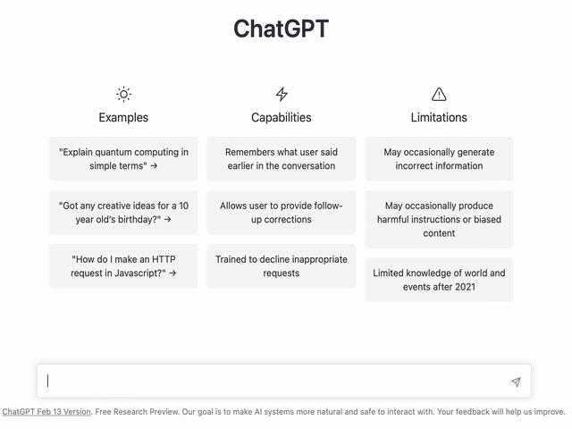

# 🔍🧠 Alfred Plugin for ChatGPT Prompts

This is a plugin for the Alfred app that provides a search feature using the array of prompts from the [awesome-chatgpt-prompts](https://github.com/f/awesome-chatgpt-prompts) project.

## Functionality

This plugin allows users to search for prompts that can be used with the ChatGPT model for generating conversational responses. The array of prompts is sourced from the awesome-chatgpt-prompts project, which is continuously updated by contributors.

The plugin fetches the latest data from the API provided by [Hugging Face](https://huggingface.co/datasets/fka/awesome-chatgpt-prompts) every 24 hours to ensure that the data is always up-to-date.

## Installation

To install the plugin, simply download the [latest release](https://github.com/bluewolfali/awesome-chatgpt-prompts-alfred/releases) and double-click on the `.alfredworkflow` file to add it to Alfred.

## Usage

Once installed, users can access the plugin by typing in the keyword `cp` followed by their search query. The plugin will display a list of prompts matching the search query, and the user can select one to copy it to their clipboard.



## Authorization

The first time you use the workflow after installing or upgrading, you will see a security warning:


This is a quirk of macOS 10.15 and above. Apple currently forces developers to pay $99 a year to be able to officially sign their executables and avoid this warning, which I'm not going to pay since I'm providing this workflow for free as an open source project.

After seeing this warning, you have to go to **System Preferences > Security & Privacy > General** and click the new button that has appeared to allow the executable to run. You then have to run it again and you will see this security warning _again_ but now it will have a new button that lets you allow the executable to run.

These warnings will appear once for each of the executables inside the workflow as you use new features. Once you have authorized all of them, you won't see these warnings anymore until you install a new version.

### Authorize All Executables

If you want to authorize all Bear Workflow executables at once or if you do not see the above security warnings but the workflow isn't working, you can do the following:

1. Go to the **Workflows** section in Alfred Preferences
2. Right click on **Bear** _by drgrib_ and select **Open in Terminal**
3. Copy this command and execute it:

```
xattr -rd com.apple.quarantine cmd
```

This should authorize all the Alfred Bear the executables and fix the security errors.

### 🍎 Apple Silicon Macs

If your mac is based on Apple Silicon chip, you need to have Rosetta installed on your system, otherwise Alfred workflows will fail silently.


Copy this command and execute in terminal to install Rosetta:

```sh
softwareupdate --install-rosetta
```

by [alfred-bear](https://github.com/drgrib/alfred-bear)

## Contribution

If you have any suggestions or feature requests, please feel free to open an issue or submit a pull request on the [GitHub repository](https://github.com/yourusername/alfred-chatgpt-prompts). Contributions are always welcome!
